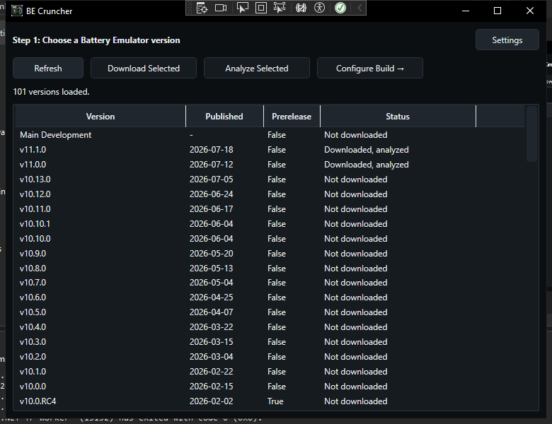
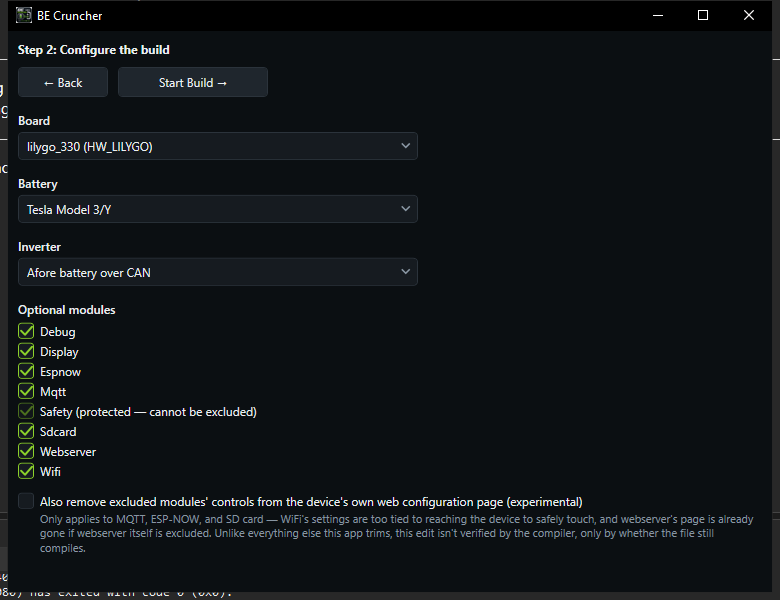
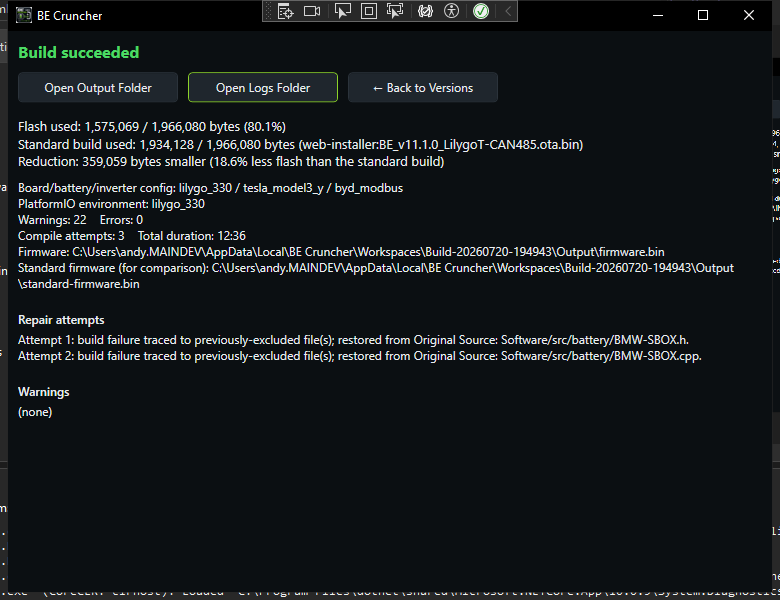

  

<h1 align="center">BE Cruncher</h1>

  An experimental, community-built Windows tool that produces smaller custom firmware builds of
  <a href="https://github.com/dalathegreat/Battery-Emulator">Battery Emulator</a> for flash-constrained ESP32 boards.

---

> ## ⚠️ Experimental — not an official Battery Emulator project
>
> **BE Cruncher is not affiliated with, endorsed by, or officially supported by the Battery Emulator project or its
> maintainers.** It's an independent, experimental side tool built by a member of the community, offered in the hope
> it's useful to people running into flash-size limits on smaller boards.
>
> It exists purely to try to help with a specific, narrow problem: **some ESP32 boards don't have enough flash for
> the full Battery Emulator firmware once every battery, inverter, and optional module is compiled in.** BE Cruncher
> tries to shrink the build down to just what a given install actually needs.
>
> Treat every build it produces as **experimental**. Verify it works correctly on your actual hardware before relying
> on it for anything that matters — this project makes no safety claims, and the people best placed to judge whether
> a change here is sound are the Battery Emulator maintainers themselves, not this tool. If this project is useful to
> the BE team in any way (ideas, a starting point, evidence something is worth doing upstream properly), that's the
> best possible outcome for it.

---

## What it does

Battery Emulator ships one firmware image containing *every* supported battery driver, *every* supported inverter
driver, and every optional feature (WiFi, MQTT, its own web configuration UI, ESP-NOW, SD-card logging, a display
driver) — because any given install might need any combination of them. That's the right call for a project
supporting dozens of hardware combinations, but it means the compiled binary is much larger than any single
installation actually uses, and on boards with limited flash that can be the difference between fitting and not.

BE Cruncher automates producing a smaller, custom build for **your specific setup**:

1. Downloads a chosen Battery Emulator release from GitHub.
2. Deterministically analyzes its source — parsing the battery/inverter registration files directly, no AI, no
   guessing — to find every selectable battery, inverter, board, and optional module.
3. Lets you pick exactly the battery, inverter, board, and optional modules you actually use.
4. Strips out everything else — the unused driver code, and (for WiFi/MQTT/webserver/ESP-NOW/SD-card) the
   corresponding call sites in the core code that reference them — and compiles the result via PlatformIO.
5. If a compile fails because something turned out to still be needed, it automatically restores that exact file
   from the untouched original source and retries, up to a bounded number of attempts — verified by the compiler,
   not guessed at.
6. Reports the real, measured flash savings against a genuine baseline (either a locally-compiled stock build, or —
   when available — the project's own published standard firmware, to avoid a redundant local compile).

Nothing here is a "trust me" percentage estimate. Every number BE Cruncher reports comes from an actual, successful
`pio run` of the trimmed firmware.

## Why

Flash size limits on the smallest supported boards are a real, recurring pain point. This tool exists to try to make
that problem smaller for people hitting it *today*, using a fully deterministic, source-level approach — not because
the Battery Emulator project is doing anything wrong, but because a general-purpose firmware necessarily carries
code that a specific installation doesn't need, and that's a solvable-per-install problem.

If any part of this approach — the driver-registration parsing, the file-exclusion logic, the automatic recovery
loop — turns out to be a useful reference or starting point for something the Battery Emulator project wants to do
properly and officially, that would be genuinely great. This project isn't trying to be a permanent fork or an
alternative distribution channel; it's a stopgap built to help in the meantime.

## Screenshots

**Choose a release** — browse and download any published Battery Emulator version, and analyze its structure
(deterministically, in a couple of seconds, no network calls beyond the initial download):

**Configure the build** — pick your board, battery, inverter, and which optional modules you actually need:

**Real, verified results** — every number here comes from an actual successful compile, compared against a genuine
baseline:

## How the size reduction actually works

- **Battery/inverter drivers**: the registration file's `enum class` + factory switch + name-lookup switch are
  parsed directly (regex/text-based, not AI) to discover every selectable component and exactly which source files
  belong exclusively to it — a file is only ever considered "exclusive" to one driver if nothing else in the
  codebase also depends on it, checked by actually scanning `#include` references across the whole source tree, not
  assumed.
- **Optional modules** (WiFi, MQTT, webserver, ESP-NOW, SD-card, display): several of these are called *directly and
  unconditionally* by core, always-compiled code (the settings loader, the CAN receive/transmit path, the logging
  path) — not just by the module's own optional init routine — so simply deleting the module's files isn't enough on
  its own. BE Cruncher finds and strips those specific call sites too, found by searching for known function/symbol
  names rather than hardcoded file paths, so it isn't fragile to files moving around between releases.
- **Automatic recovery**: if excluding something breaks the build, the exact missing file is restored from the
  untouched original download and the build is retried — bounded, deterministic, and verified by an actual
  recompile each time, never assumed to have worked.
- **Safety-critical code is never touched.** Anything whose path mentions safety, watchdog, precharge, contactor,
  interlock, or fault handling is permanently protected and can never be excluded or edited, regardless of what's
  selected in the UI.

## A known, honestly-labelled experimental edge

One feature — optionally also removing a disabled module's now-inert controls from the device's *own* web
configuration page — is opt-in and clearly marked experimental in the app itself. Every other trim this tool makes
is verified by the compiler: if something breaks, the build fails and you know immediately. That one specific
feature edits HTML embedded in a C++ source file, and a mistake there wouldn't fail the build — it would just render
subtly wrong. It defaults to **off**.

## Building it yourself

- Windows, .NET 10 SDK, WPF workload.
- [PlatformIO Core](https://platformio.org/) available on `PATH` (used to actually compile the trimmed firmware).
- Open `BE Cruncher.slnx` / `BE Cruncher.csproj` and build normally, or `dotnet build`.

All state (downloaded releases, build workspaces, cached data) lives under `%LOCALAPPDATA%\BE Cruncher\` by default —
configurable from the app's Settings page. Nothing is written outside that folder (and your chosen output location).

## Status

Actively evolving, used and tested against real Battery Emulator releases with real hardware targets, but still a
side project maintained by one person in their spare time. Expect rough edges. Issues and pull requests are welcome,
but please keep the disclaimer above in mind — this is not a substitute for testing your own build on your own
hardware before relying on it.
